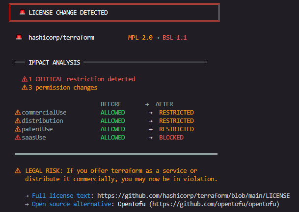

<div align="center">
  
  <br/>
  <br/>
  <p><strong>OSS license watchdog. Know before it's too late.</strong></p>
  <p>
    <a href="./LICENSE"></a>
    <a href="https://nodejs.org"></a>
    
    
  </p>
</div>

---

> *Redis changed its license. HashiCorp changed its license. Elasticsearch changed its license.*
> *You found out too late.*
>
> **LicensePulse watches the OSS repos you depend on and tells you exactly what changed before it becomes your problem.**

---

## The Problem

License scanners check **your** project. Nobody watches **theirs**.

When MongoDB, Redis, HashiCorp, and Elasticsearch changed their licenses, thousands of teams found out after the fact during audits, legal reviews, or worse. There was no open source tool monitoring these changes continuously.

**LicensePulse fixes that.**

---

## What It Looks Like

<div align="center">
  
</div>

When a license changes, LicensePulse doesn't just say *"it changed"*. It tells you what you could do before and what you can't do now.

---

## Quick Start

```bash
git clone https://github.com/diegosantdev/licensepulse
cd licensepulse
npm install
cp .env.example .env
# Add your GITHUB_TOKEN to .env
```

```bash
# Add repos to monitor
node bin/licensepulse.js add redis/redis
node bin/licensepulse.js add hashicorp/terraform
node bin/licensepulse.js add elastic/elasticsearch

# Check for changes
node bin/licensepulse.js check
```

Get a GitHub token at [github.com/settings/tokens](https://github.com/settings/tokens) (only `public_repo` scope needed).

---

## Commands

| Command | Description |
|---------|-------------|
| `check` | Check all repos once |
| `watch` | Check on interval (default: 24h) |
| `add <repo>` | Add repo to watchlist |
| `remove <repo>` | Remove repo from watchlist |
| `list` | List all monitored repos |
| `diff <repo>` | Show last known license change |
| `report` | Generate JSON report |

### `check`

```
╔════════════════════════════════════════════════════════════╗
║  LicensePulse • Checking repos...                          ║
║  4 repositories                                            ║
╚════════════════════════════════════════════════════════════╝

  ✓  facebook/react                      MIT
  ✓  golang/go                           BSD-3-Clause
  ✓  mongodb/mongo                       SSPL-1.0      ⚠ restricted
  ✓  hashicorp/terraform                 BSL-1.1       ⚠ restricted

────────────────────────────────────────────────────────────────
  4 checked  •  2 warnings
────────────────────────────────────────────────────────────────
```

### `diff <repo>`

```
╔════════════════════════════════════════════════════════════╗
║  LicensePulse • hashicorp/terraform                        ║
╚════════════════════════════════════════════════════════════╝

  🚨  hashicorp/terraform          MPL-2.0 → BSL-1.1


  ═══ IMPACT ANALYSIS ════════════════════════════════════

    ⚠ 1 CRITICAL restriction detected
    ⚠ 3 permission changes

                           BEFORE       →  AFTER
  ⚠ commercialUse          ALLOWED       →  RESTRICTED
  ⚠ distribution           ALLOWED       →  RESTRICTED
  ⚠ patentUse              ALLOWED       →  RESTRICTED
  ⚠ saasUse                ALLOWED       →  BLOCKED

  ═══════════════════════════════════════════════════════════

  ⚠  LEGAL RISK: If you offer terraform as a service or
     distribute it commercially, you may now be in violation.

     → Full license text: https://github.com/hashicorp/terraform/blob/main/LICENSE
     → Open source alternative: OpenTofu (https://github.com/opentofu/opentofu)
```

### `report`

```bash
node bin/licensepulse.js report
node bin/licensepulse.js report --output report.json
```

```json
{
  "generated_at": "2026-03-24T09:00:00Z",
  "repos_checked": 4,
  "alerts": [
    {
      "repo": "hashicorp/terraform",
      "before": "MPL-2.0",
      "after": "BSL-1.1",
      "changed_at": "2023-08-10T14:30:00Z",
      "impact": {
        "commercialUse": "RESTRICTED",
        "saasUse": "BLOCKED",
        "distribution": "RESTRICTED"
      }
    }
  ]
}
```

---

## Automate with GitHub Actions

Set it and forget it. Run LicensePulse every Monday to catch license changes automatically.

```yaml
name: License Monitor

on:
  schedule:
    - cron: '0 9 * * 1'
  workflow_dispatch:

jobs:
  check:
    runs-on: ubuntu-latest
    steps:
      - uses: actions/checkout@v3

      - name: Setup Node.js
        uses: actions/setup-node@v3
        with:
          node-version: '18'

      - name: Install dependencies
        run: npm install

      - name: Check licenses
        run: node bin/licensepulse.js check
        env:
          GITHUB_TOKEN: ${{ secrets.GITHUB_TOKEN }}
          SLACK_WEBHOOK_URL: ${{ secrets.SLACK_WEBHOOK_URL }}
```

---

## Configuration

Environment variables for notifications and settings:

```env
# Required
GITHUB_TOKEN=your_github_token_here

# Slack notifications (optional)
SLACK_WEBHOOK_URL=https://hooks.slack.com/services/YOUR/WEBHOOK/URL

# Email notifications via SMTP (optional)
SMTP_HOST=smtp.example.com
SMTP_PORT=587
SMTP_USER=you@example.com
SMTP_PASS=yourpassword
NOTIFY_EMAIL=team@example.com

# Generic webhook (optional)
WEBHOOK_URL=https://your-endpoint.com/hook

# Check interval for watch mode (default: 24h)
CHECK_INTERVAL_HOURS=24
```

---

## How It Works

1. First run snapshots the current license of every repo in your watchlist
2. Subsequent runs fetch the current license and compare with snapshot
3. Change detected? Diffs the permission attributes using the built-in SPDX database
4. Alert sent via CLI output + Slack, email, or webhook if configured

### License Database

42+ licenses tracked across 4 categories:

| Category | Licenses |
|----------|----------|
| Permissive | MIT, Apache-2.0, BSD-2/3-Clause, ISC, Unlicense, CC0-1.0, and more |
| Weak copyleft | MPL-2.0, LGPL-2.1/3.0, EPL-1.0/2.0, EUPL-1.1/1.2, and more |
| Strong copyleft | GPL-2.0, GPL-3.0, AGPL-3.0 |
| Restrictive / source-available | SSPL-1.0, BSL-1.1, RSALv2, Elastic-2.0, CSL, and more |

Each license is mapped to 6 permission attributes: `commercialUse`, `distribution`, `modification`, `patentUse`, `privateUse`, `saasUse`.

When a license changes, LicensePulse diffs only the attributes that changed, not a wall of legal text.

---

## Real Cases This Would Have Caught

| Project | Year | Change | Impact |
|---------|------|--------|--------|
| **Redis** | 2024 | BSD-3-Clause → RSALv2 + SSPL-1.0 | Commercial use restricted, SaaS blocked |
| **HashiCorp Terraform** | 2023 | MPL-2.0 → BSL-1.1 | SaaS blocked, commercial restricted |
| **Elasticsearch** | 2021 | Apache-2.0 → SSPL-1.0 | Cloud hosting restricted |
| **MongoDB** | 2018 | AGPL-3.0 → SSPL-1.0 | SaaS use blocked |

LicensePulse would have alerted you the day each of these happened.

---

## Why Not Dependabot?

Dependabot tracks security vulnerabilities and version updates. It does not monitor license changes. Neither does Snyk, FOSSA, or any popular open source tool in active use today.

LicensePulse does one thing: watches licenses on repos you depend on and explains what a change means for your business.

---

## Project Structure

```
licensepulse/
├── src/
│   ├── cli.js          # Entry point, command routing
│   ├── watcher.js      # GitHub API client + license detection
│   ├── differ.js       # Snapshot management and comparison
│   ├── explainer.js    # SPDX database and impact analysis
│   ├── watchlist.js    # Watchlist management
│   └── config.js       # Configuration management
├── data/
│   └── licenses.json   # SPDX license database (42+ licenses)
├── tests/
│   ├── unit/           # Unit tests
│   └── integration/    # Integration tests
├── bin/
│   └── licensepulse.js # Executable entry point
├── .licensepulse/
│   └── snapshots/      # Auto-generated (gitignored)
└── watchlist.json      # Your monitored repos
```

---

## Roadmap

- [ ] `npm install -g licensepulse` global install
- [ ] `package.json` auto-import to detect all deps automatically
- [ ] GitLab and Bitbucket support
- [ ] Discord and Microsoft Teams notifications
- [ ] License risk score per repo
- [ ] Web dashboard

---

## Contributing

PRs welcome. See [CONTRIBUTING.md](./CONTRIBUTING.md) for guidelines.

The most impactful contributions right now:

- Expanding `data/licenses.json` with more license mappings
- Improving impact explanation language
- Adding notification channels (Discord, Teams)
- Supporting GitLab and Bitbucket

---

## License

MIT License. Built by [@diegosantdev](https://github.com/diegosantdev).