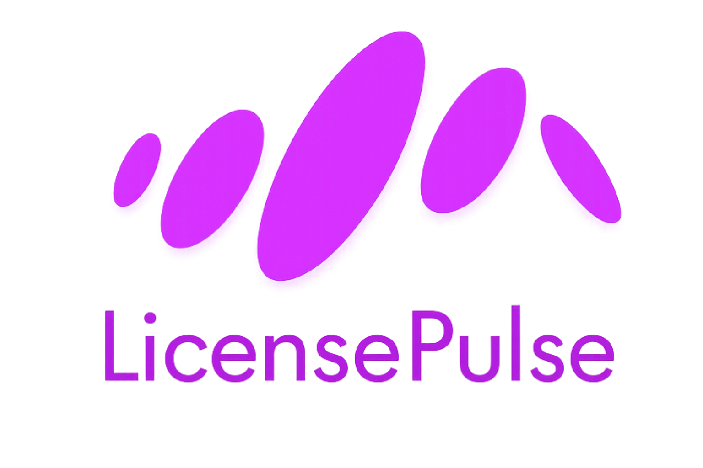
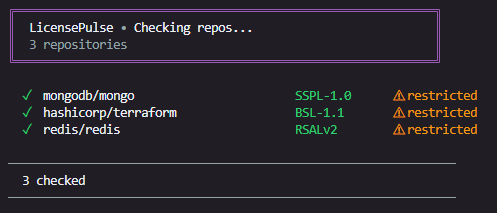
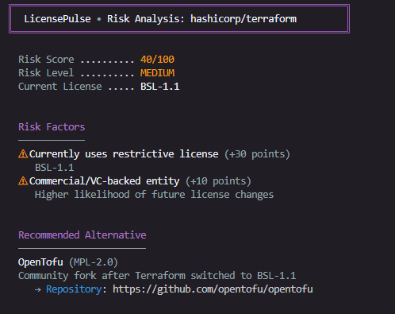
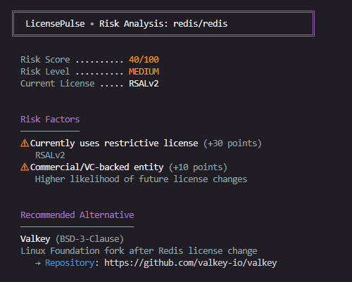
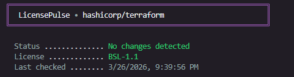
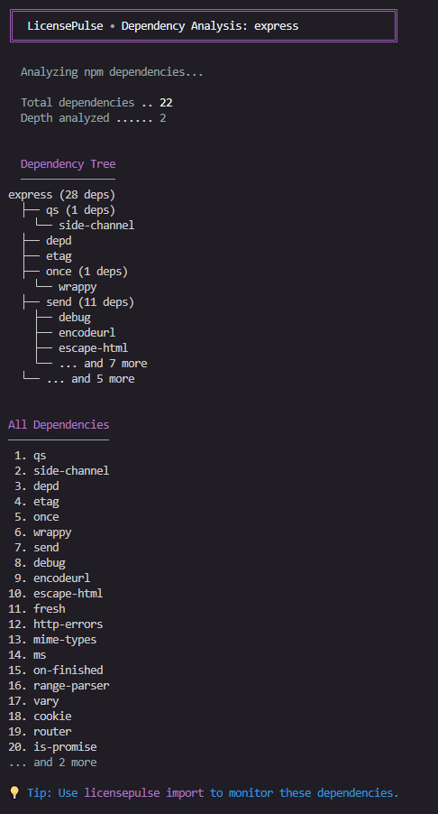

<div align="center">
  
  <br/>
  <br/>
  <p><strong>OSS license watchdog. Track changes early, decide with context.</strong></p>
  <p>
    <a href="./LICENSE"></a>
    <a href="https://nodejs.org"></a>
    
    <a href="https://github.com/diegosantdev/licensepulse/actions"></a>
    
    
    
  </p>
  <p>
    <strong>🆕 v1.2.0:</strong> Direct LICENSE file monitoring + Dependency graph analysis
    <br/>
    <a href="./UPDATES.md">See what's new →</a>
  </p>
</div>

---

> *Redis changed its license. HashiCorp changed its license. Elasticsearch changed its license.*
> *You found out too late.*
>
> **LicensePulse watches the OSS repos you depend on and tells you exactly what changed before it becomes your problem.**

---

## The Problem

License scanners check **your** project. Nobody watches **theirs**.

When MongoDB, Redis, HashiCorp, and Elasticsearch changed their licenses, thousands of teams found out after the fact during audits, legal reviews, or worse. There was no open source tool monitoring these changes continuously.

**LicensePulse fixes that.**

---

## What It Does

When a license changes, LicensePulse doesn't just say *"it changed"*. It shows you what changed, which usage models may be affected, and where closer review may be needed depending on your business model.

---

### License Detection with Warnings

<div align="center">
  
</div>

Instantly identifies restrictive licenses across your dependencies.

### Risk Analysis

<div align="center">
  
</div>

Risk scoring with automatic alternative suggestions (Terraform → OpenTofu).

<div align="center">
  
</div>

Consistent pattern detection (Redis → Valkey).

### Auto-Import Dependencies

<div align="center">
  
</div>

Zero-friction onboarding - discovers all dependencies automatically.

### Dependency Graph Analysis

<div align="center">
  
</div>

Complete transitive dependency analysis (22 dependencies discovered for Express).

---

## Quick Start

```bash
git clone https://github.com/diegosantdev/licensepulse
cd licensepulse
npm install
cp .env.example .env
# Add your GITHUB_TOKEN to .env
```

```bash
# Add repos to monitor
node bin/licensepulse.js add redis/redis
node bin/licensepulse.js add hashicorp/terraform
node bin/licensepulse.js add elastic/elasticsearch

# Check for changes
node bin/licensepulse.js check
```

Get a GitHub token at [github.com/settings/tokens](https://github.com/settings/tokens) (only `public_repo` scope needed).

---

## Commands

| Command | Description |
|---------|-------------|
| `check` | Check all repos once |
| `watch` | Check on interval (default: 24h) |
| `add <repo>` | Add repo to watchlist |
| `remove <repo>` | Remove repo from watchlist |
| `list` | List all monitored repos |
| `diff <repo>` | Show last known license change with version cutoff |
| `import` | Auto-import dependencies from package.json/requirements.txt |
| `risk <repo>` | Show risk score and analysis for a repository |
| `monitor-file <repo>` | Monitor LICENSE file changes directly in GitHub 🆕 |
| `deps <package>` | Show dependency tree and transitive dependencies 🆕 |
| `report` | Generate JSON report |

### `check`

```
╔════════════════════════════════════════════════════════════╗
║  LicensePulse • Checking repos...                          ║
║  4 repositories                                            ║
╚════════════════════════════════════════════════════════════╝

  ✓  facebook/react                      MIT
  ✓  golang/go                           BSD-3-Clause
  ✓  mongodb/mongo                       SSPL-1.0      ⚠ restricted
  ✓  hashicorp/terraform                 BSL-1.1       ⚠ restricted

────────────────────────────────────────────────────────────────
  4 checked  •  2 warnings
────────────────────────────────────────────────────────────────
```

### `diff <repo>`

```
╔════════════════════════════════════════════════════════════╗
║  LicensePulse • hashicorp/terraform                        ║
╚════════════════════════════════════════════════════════════╝

  🚨  hashicorp/terraform          MPL-2.0 → BSL-1.1
       Safe up to: v1.5.7 │ Changed in: v1.6.0


  ═══ IMPACT ANALYSIS ════════════════════════════════════

    ⚠ 1 CRITICAL restriction detected
    ⚠ 3 permission changes

                           BEFORE       →  AFTER
  ⚠ commercialUse          ALLOWED       →  RESTRICTED
  ⚠ distribution           ALLOWED       →  RESTRICTED
  ⚠ patentUse              ALLOWED       →  RESTRICTED
  ⚠ saasUse                ALLOWED       →  REQUIRES_REVIEW

  ═══════════════════════════════════════════════════════════

  ⚠  LICENSE CHANGE IMPACT: Some usage models may now be restricted.
     Review the changes above and consult the license terms for your use case.

     → Full license text: https://github.com/hashicorp/terraform/blob/main/LICENSE
     → Open source alternative: OpenTofu (https://github.com/opentofu/opentofu)
       Community fork after Terraform switched to BSL-1.1
```

### `import`

Auto-discover and add all your dependencies to the watchlist:

```bash
# Dry run to see what would be imported
node bin/licensepulse.js import --dry-run

# Import from current directory
node bin/licensepulse.js import

# Import from specific directory
node bin/licensepulse.js import --directory ./my-project
```

Supports:
- `package.json` (npm dependencies)
- `requirements.txt` (Python dependencies)

### `risk <repo>`

Get a risk score based on license history and patterns:

```
╔════════════════════════════════════════════════════════════╗
║  LicensePulse • Risk Analysis: hashicorp/terraform         ║
╚════════════════════════════════════════════════════════════╝

  Risk Score:              70/100
  Risk Level:              HIGH
  Current License:         BSL-1.1

  ═══ Risk Factors ═══════════════════════════════════════

  ⚠ License changed previously (+40 points)
     MPL-2.0 → BSL-1.1
  
  ⚠ Currently uses restrictive license (+30 points)
     BSL-1.1

  ═══ Recommended Alternative ════════════════════════════

  OpenTofu (MPL-2.0)
  Community fork after Terraform switched to BSL-1.1
  → Repository: https://github.com/opentofu/opentofu

  ⚠ HIGH RISK: Consider monitoring this repository closely 
     or switching to an alternative.
```

### `report`

```bash
node bin/licensepulse.js report
node bin/licensepulse.js report --output report.json
```

```json
{
  "generated_at": "2026-03-24T09:00:00Z",
  "repos_checked": 4,
  "alerts": [
    {
      "repo": "hashicorp/terraform",
      "before": "MPL-2.0",
      "after": "BSL-1.1",
      "changed_at": "2023-08-10T14:30:00Z",
      "impact": {
        "commercialUse": "RESTRICTED",
        "saasUse": "REQUIRES_REVIEW",
        "distribution": "RESTRICTED"
      }
    }
  ]
}
```

---

## Automate with GitHub Actions

Set it and forget it. Run LicensePulse every Monday to catch license changes automatically.

```yaml
name: License Monitor

on:
  schedule:
    - cron: '0 9 * * 1'
  workflow_dispatch:

jobs:
  check:
    runs-on: ubuntu-latest
    steps:
      - uses: actions/checkout@v3

      - name: Setup Node.js
        uses: actions/setup-node@v3
        with:
          node-version: '18'

      - name: Install dependencies
        run: npm install

      - name: Check licenses
        run: node bin/licensepulse.js check
        env:
          GITHUB_TOKEN: ${{ secrets.GITHUB_TOKEN }}
          SLACK_WEBHOOK_URL: ${{ secrets.SLACK_WEBHOOK_URL }}
```

---

## Configuration

Environment variables for notifications and settings:

```env
# Required
GITHUB_TOKEN=your_github_token_here

# Slack notifications (optional)
SLACK_WEBHOOK_URL=https://hooks.slack.com/services/YOUR/WEBHOOK/URL

# Email notifications via SMTP (optional)
SMTP_HOST=smtp.example.com
SMTP_PORT=587
SMTP_USER=you@example.com
SMTP_PASS=yourpassword
NOTIFY_EMAIL=team@example.com

# Generic webhook (optional)
WEBHOOK_URL=https://your-endpoint.com/hook

# Check interval for watch mode (default: 24h)
CHECK_INTERVAL_HOURS=24
```

---

## How It Works

1. First run snapshots the current license of every repo in your watchlist
2. Subsequent runs fetch the current license and compare with snapshot
3. Change detected? Diffs the permission attributes using the built-in SPDX database
4. Alert sent via CLI output + Slack, email, or webhook if configured

### License Database

42+ licenses tracked across 4 categories:

| Category | Licenses |
|----------|----------|
| Permissive | MIT, Apache-2.0, BSD-2/3-Clause, ISC, Unlicense, CC0-1.0, and more |
| Weak copyleft | MPL-2.0, LGPL-2.1/3.0, EPL-1.0/2.0, EUPL-1.1/1.2, and more |
| Strong copyleft | GPL-2.0, GPL-3.0, AGPL-3.0 |
| Restrictive / source-available | SSPL-1.0, BSL-1.1, RSALv2, Elastic-2.0, CSL, and more |

Each license is mapped to 6 permission attributes: `commercialUse`, `distribution`, `modification`, `patentUse`, `privateUse`, `saasUse`.

When a license changes, LicensePulse diffs only the attributes that changed, not a wall of legal text.

---

## Real Cases This Would Have Caught

| Project | Year | Change | Impact |
|---------|------|--------|--------|
| **Redis** | 2024 | BSD-3-Clause → RSALv2 + SSPL-1.0 | Competitive and hosted use cases require review |
| **HashiCorp Terraform** | 2023 | MPL-2.0 → BSL-1.1 | Some commercial and hosted use cases restricted |
| **Elasticsearch** | 2021 | Apache-2.0 → SSPL-1.0 | Managed service offerings require review |
| **MongoDB** | 2018 | AGPL-3.0 → SSPL-1.0 | SaaS use cases require careful review |

LicensePulse would have alerted you the day each of these happened.

**Note:** LicensePulse surfaces practical license-change impact to help teams stay informed. It is not legal advice. Consult your legal team for guidance on how license changes affect your specific use case.

---

## Why Not Dependabot?

Dependabot tracks security vulnerabilities and version updates. It does not monitor license changes. Neither does Snyk, FOSSA, or any popular open source tool in active use today.

**LicensePulse is the only tool that:**
- Shows exactly which version the license changed in
- Monitors the LICENSE file directly in the repo (catches changes before npm/PyPI publish)
- Auto-imports your dependencies from package.json/requirements.txt
- Calculates risk scores based on license change history
- Suggests open source alternatives automatically

---

## What's New in v1.1

Based on community feedback:

**Version Cutoff** - Shows exactly which version is safe to use and which version introduced the license change.

```
hashicorp/terraform    MPL-2.0 → BSL-1.1
Safe up to: v1.5.7 │ Changed in: v1.6.0
```

**GitHub Repo Monitoring** - Monitors the LICENSE file directly in the repository, not just published packages. Catches changes in the window between commit and npm/PyPI publish (exactly where Redis and HashiCorp cases happened).

**Auto-Import** - Detects dependencies from package.json and requirements.txt automatically. No more adding repos one by one.

```bash
licensepulse import
# Discovers all your dependencies and adds them to watchlist
```

**Risk Scoring** - Calculates risk score (0-100) based on license history. Repos that changed once are more likely to change again.

```bash
licensepulse risk hashicorp/terraform
# Risk Score: 70/100 (HIGH)
```

---

## Project Structure

```
licensepulse/
├── src/
│   ├── cli.js          # Entry point, command routing
│   ├── watcher.js      # GitHub API client + license detection
│   ├── differ.js       # Snapshot management and comparison
│   ├── explainer.js    # SPDX database and impact analysis
│   ├── watchlist.js    # Watchlist management
│   └── config.js       # Configuration management
├── data/
│   └── licenses.json   # SPDX license database (42+ licenses)
├── tests/
│   ├── unit/           # Unit tests
│   └── integration/    # Integration tests
├── bin/
│   └── licensepulse.js # Executable entry point
├── .licensepulse/
│   └── snapshots/      # Auto-generated (gitignored)
└── watchlist.json      # Your monitored repos
```

---

## Contributing

PRs welcome. See [CONTRIBUTING.md](./CONTRIBUTING.md) for guidelines.

The most impactful contributions right now:

- Expanding `data/licenses.json` with more license mappings
- Improving impact explanation language
- Adding notification channels (Discord, Teams)
- Supporting GitLab and Bitbucket

---

## License

MIT License. Built by [@diegosantdev](https://github.com/diegosantdev).